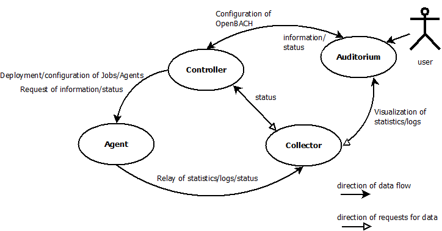

OpenBACH
========

OpenBACH is funded and promoted by CNES (French Space Center) as a reference
open-source software tool within its research and development studies and
activities in the domain of satellite communication systems and networks.

OpenBACH is a user-friendly and efficient benchmark to configure, supervise and
control your network under test (e.g. terrestrial networks, satellite networks,
WAN, LAN, etc.). It provides an efficient modular structure to facilitate the
additions of new software tools, monitoring parameters, tasks, etc. The
benchmark is able to be integrated in different types of equipments, servers,
clients, hardware and software with minimal adaptation effort.

The documentation is scattered in this repository through README files at
appropriate places, a table of content is available below.

Design Principles
=================

  * A **user** can pilot OpenBACH through a web or command-line **Auditorium** interface
  * This interface manipulates metrology **scenarios** on OpenBACH **Controller**
  * The controller orchestrate **jobs** on distributed **Agents**
  * Agents can send stats and logs to OpenBACH global **collector**
  * The web auditorium provides ways to visualize these stats and logs (using Grafana and Kibana)
  * The user can code new jobs, install them on the agents and launch them with the controller

The full design is available in details in [the design document](documents/design/design_openbach.adoc).

Manuals
=======

Various manuals are available in this repository:
  * [Installation manual](ansible/README.md)
  * [User manual](src/auditorium/ihm/README.md)
  * [Administrator manual](src/auditorium/README.md)
  * [Developer manual](src/README.md)

Get Involved
============

  * See OpenBACH web site: http://www.openbach.org/
  * A mailing list is available: users@openbach.org
  * You can also find the [Frequently asked questions](documents/support/FAQ.md)
    and a [troubleshooting guide](documents/support/Troubleshooting.md)

Examples of project using OpenBACH
==================================

  * A simple example chaining reference scenarios in python is available [here][1]

Project Partners
================

Vivéris Technologies

Authors
=======

  *  Adrien Thibaud      (Vivéris Technologies),      adrien.thibaud@viveris.fr
  *  Mathias Ettinger    (Vivéris Technologies),      mathias.ettinger@viveris.fr
  *  Léa Thibout         (Vivéris Technologies),      lea.thibout@viveris.fr
  *  David Fernandes     (Vivéris Technologies),      david.fernandes@viveris.fr
  *  Joaquin Muguerza    (Vivéris Technologies),      joaquin.muguerza@viveris.fr
  *  Bastien Tauran      (Vivéris Technologies),      bastien.tauran@viveris.fr
  *  Francklin Simo      (Vivéris Technologies),      francklin.simo@viveris.fr
  *  Mathieu Petrou      (Vivéris Technologies),      mathieu.petrou@viveris.fr
  *  Oumaima Zerrouq     (Vivéris Technologies),      oumaima.zerrouq@viveris.fr
  *  David Pradas        (Vivéris Technologies),      david.pradas@viveris.fr
  *  Emmanuel Dubois     (CNES),                      emmanuel.dubois@cnes.fr
  *  Nicolas Kuhn        (CNES),                      nicolas.kuhn@cnes.fr 
  *  Santiago Garcia Guillen (CNES),                  santiago.garciaguillen@cnes.fr

Licence
=======

Copyright © 2016-2020 CNES
OpenBACH is released under GPLv3 (see [LICENSE](LICENSE.md) file).

The OpenBACH core uses third-party software components. Below, we list their licences:

  * Ansible: GPLv3
  * ELK (ElasticSearch, Logstash and Kibana): Apache 2.0
  * Grafana: Apache 2.0
  * InfluxDB: MIT
  * Django: BSD 3-clauses
  * Nginx: BSD 2-clauses

[1]: https://github.com/CNES/openbach-extra/tree/master/executors/examples
